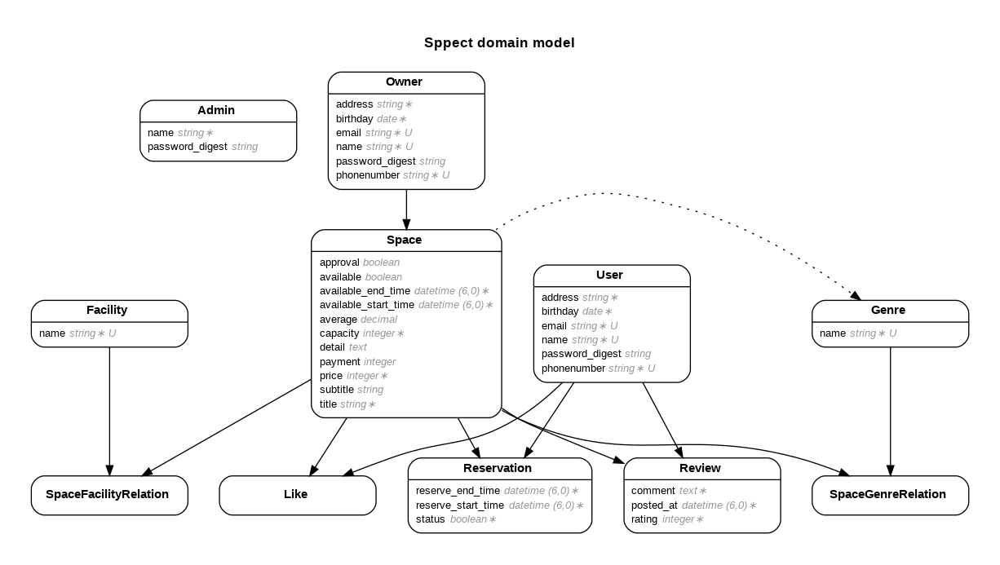
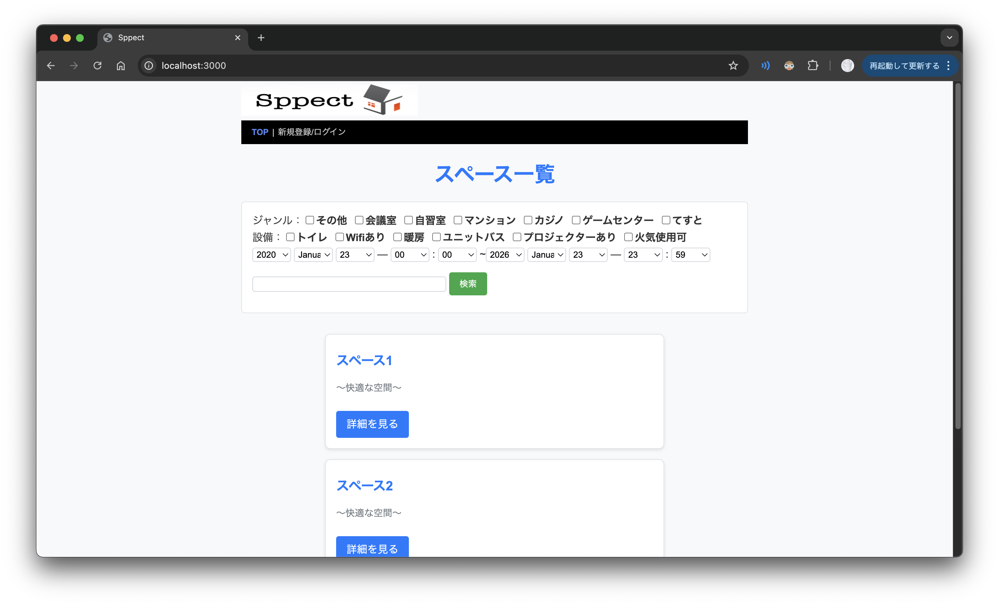
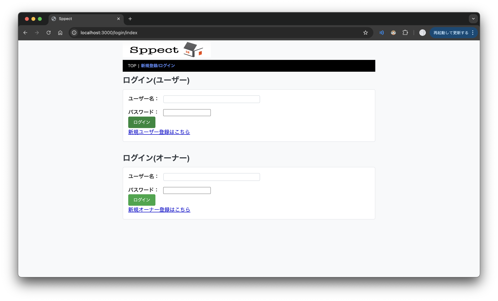
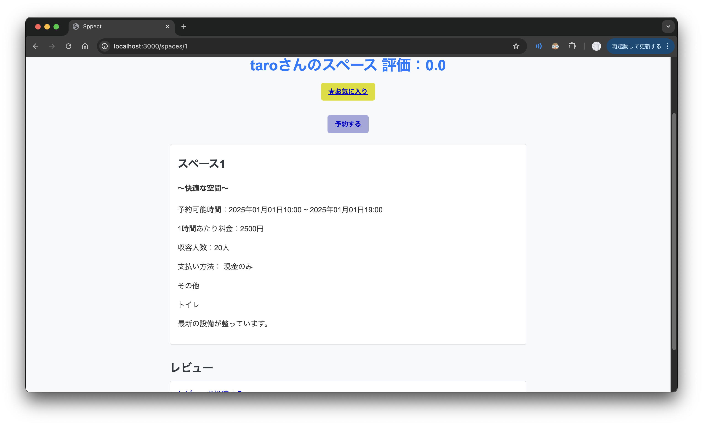

# Sppect — イベントスペース予約アプリ

## 概要

**Sppect** は、イベントや勉強会などのためにスペースを貸し借りできる、Webベースの予約アプリケーションです。  
以下の 3 つの立場のユーザーが利用することを前提に、**Ruby on Rails** を用いて 1 から実装しました。

- **一般ユーザー**：スペースの検索・予約・レビュー・お気に入り登録
- **オーナー**：自分のスペースの登録・編集・予約管理
- **管理者**：スペース・ユーザー・オーナーアカウント全体の監視・管理


## 開発背景

大学の授業の最終課題として、自分たちで発想した予約システムを、設計から実装まで行うことがテーマでした。

- **チームで担当**：  
  - アイデア出し  
  - ユースケース図  
  - 画面遷移図・ER図  
  - テスト仕様書の作成
  - 相互テスト
- **個人で担当**：  
  - Rails を用いたアプリケーション実装全般  

チームで設計した内容を、自分一人でコードベースに落とし込むことで、  
**要件定義 → 設計 → 実装 → テスト** の一連の流れを経験することを目的としました。

---

## ドメインモデル・ER 図

アプリケーションのドメインは、以下のようなモデルで構成されています。

- ユーザー関連
  - 一般ユーザー（スペースを借りる）
  - オーナー（スペースを貸し出す）
  - 管理者（全体管理）
- スペース関連
  - スペース（部屋情報）
  - 予約（どのユーザーが、どのスペースを、いつ利用するか）
  - レビュー（ユーザーによるスペースの評価）
  - お気に入り（ユーザーのお気に入りスペース）

これらを関連付けることで、

- 「あるユーザーの今後の予約一覧」
- 「あるオーナーが管理しているスペースの予約状況」
- 「スペースごとのレビュー評価」
- 「ユーザーのお気に入りスペース一覧」

などを取得できるようにしています。

リポジトリには ER 図も含めています：



---

## 主な機能

### ユーザー向け

- スペース一覧・詳細の閲覧
- 日付・条件を指定した予約
- 予約履歴の確認
- レビュー投稿・閲覧
- お気に入り登録 / 解除

### オーナー向け

- 自身が貸し出すスペースの新規登録 / 編集
- スペースの公開 / 非公開制御
- 予約状況の確認（どのユーザーが、いつ利用するか）

### 管理者向け

- ユーザーアカウントの一覧・状態管理
- スペースの一覧・状態管理
- 不適切なレビューやデータのチェック（想定）





---

## 権限設計

3 種類の立場（一般ユーザー / オーナー / 管理者）を扱うため、権限周りの設計を重視しました。

- ログインユーザーの権限（ロール）に応じて、  
  - アクセスできる画面  
  - 実行できる操作（例：スペースの編集・削除）  
  を制限
- 自分がオーナーとして登録したスペースのみ編集できるように制御
- 管理者のみが利用できる管理用画面（スペース・アカウントの一覧・管理）

このように、**1つのシステムの中に異なる視点のユーザーを共存させる**ことを意識して実装しました。

---

## 技術スタック

- **言語 / フレームワーク**
  - Ruby
  - Ruby on Rails
- **データベース**
  - SQLite3
- **フロントエンド**
  - ERB テンプレート
  - HTML / CSS
- **その他**
  - Bundler（依存関係管理）


---

## 工夫した点・苦労した点

- **複数テーブルの関連付け**
  - 予約、スペース、レビュー、お気に入りなど、複数のモデルを関連付けて扱う必要があり、
    - モデル間の関連（`has_many` / `belongs_to` など）
    - 外部キー制約
    - データ削除時の挙動（関連データの扱い）
    を整理するのに時間をかけました。

- **ロールの違いによる画面と機能の分岐**
  - 一般ユーザー・オーナー・管理者で利用できる機能が異なるため、
    - コントローラでのアクセス制御
    - ビューの条件分岐
  を行い、1つのアプリケーションの中で 3 種類の利用者を扱えるようにしました。


---

## セットアップについて
授業の都合により、Gitの内容がDockerイメージの中身のみの更新となっているため、おそらくそのままCloneしただけでは動きません。
動かす場合は、以下のコマンドを参考に各自でDockerイメージを作成・実行し、http://localhost:3000 にアクセスしてください。
```bash
#Dockerイメージの作成
docker build -t ns-rails:2024 .
#コンテナ起動
docker run -p 3000:3000 -v $(pwd)/rails:/var/www -w /var/www --name rails24 -d ns-rails:2024 tail -f /dev/null
#コンテナへのログイン
docker exec -it rails24 bash
#フォルダ移動
cd sppect
#依存関係のインストール
bundle install
#アプリケーション立ち上げ
bin/rails s -b 0.0.0.0 &
```
Dockerfileの中身は以下の通りです。
```
FROM ruby:3.1.6-bullseye

ENV LANG="C.UTF-8" \
    TZ="Asia/Tokyo" \
    RAILS_VERSION="7.0.4"

RUN apt-get update && apt-get install -y vim git less && rm -rf /var/lib/apt/lists/*
	
RUN apt-get update && apt-get install -y sqlite3 && rm -rf /var/lib/apt/lists/*

RUN apt-get update && apt-get -y install build-essential && rm -rf /var/lib/apt/lists/*

RUN gem install rails --version "$RAILS_VERSION" -N

RUN gem update bundler

RUN git config --global init.defaultBranch main

EXPOSE 3000

```

